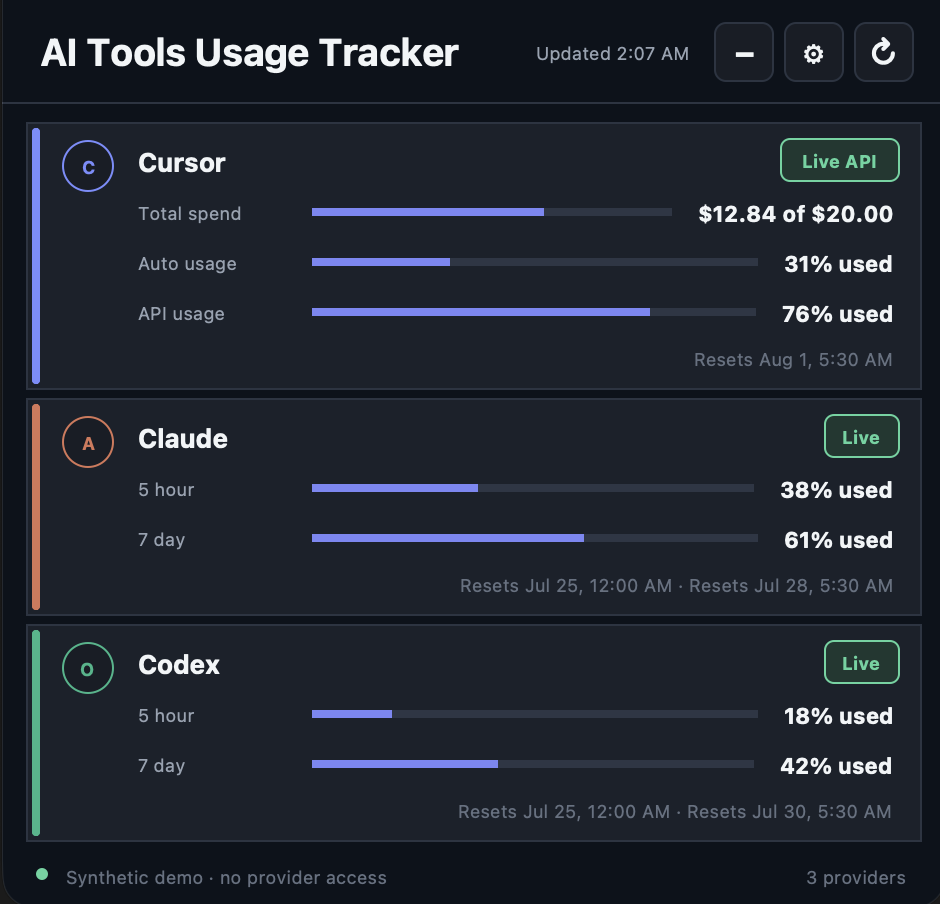
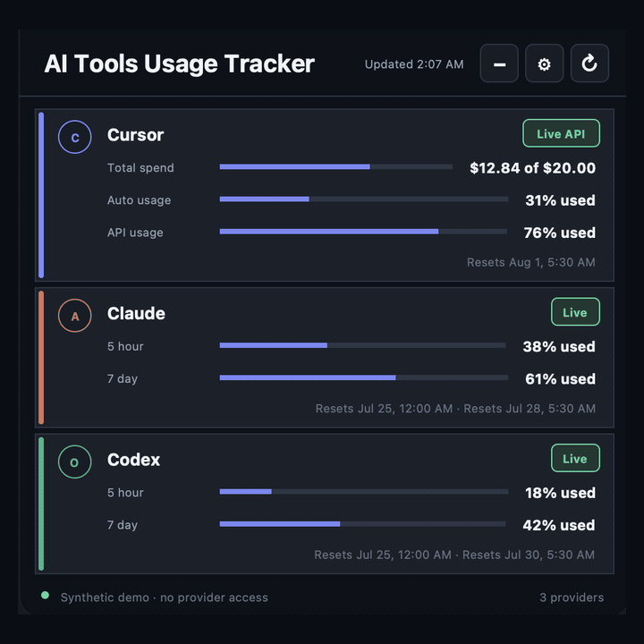
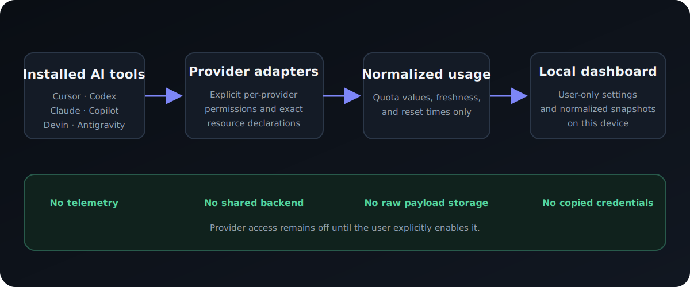

# AI Tools Usage Tracker

[](https://github.com/mohitkale/ai-tools-usage-tracker/actions/workflows/ci.yml)
[](LICENSE)

**One privacy-first desktop widget for your AI coding usage, quotas, and reset
times.**

Track Cursor, Codex, Claude Code, GitHub Copilot CLI, Devin, and Antigravity
across macOS, Windows, and Linux—with no telemetry and no copied or stored
provider credentials.

<p align="center">
  
</p>

<p align="center">
  <em>The real application rendered in its offline synthetic demo mode. No provider was accessed.</em>
</p>

[Quick start](#quick-start) ·
[Supported providers](#supported-providers) ·
[Privacy model](#privacy-by-design) ·
[Project status](#project-status)

> **Source preview:** the source is ready for review and compatibility testing.
> Public binary downloads are not available while signing, notarization, and
> release-supply-chain work is completed.

## Why this exists

Every AI coding tool reports usage differently. Some expose rolling quota
windows, some show spend, and others provide only local counters or cached
credits. Checking several dashboards interrupts the work those tools are meant
to accelerate.

AI Tools Usage Tracker brings the available signals into one compact,
always-on-top view without sending your activity to another analytics service.

## What it gives you

- One dashboard for multiple AI coding tools.
- Usage, remaining allowance, and reset times where the provider exposes them.
- Clear Live, Local, Cached, and Unavailable states.
- A 340-pixel compact mode for an unobtrusive at-a-glance view.
- Explicit permission controls for each provider.
- Local normalized snapshots only—never raw provider responses.
- No telemetry, analytics, remote configuration, or automatic updates.

## Supported providers

| Provider | What the tracker can show | Data source |
| --- | --- | --- |
| Cursor | Spend, Total/Auto/API usage, reset time | Live, experimental |
| Codex | Rolling quota usage and reset times | Live |
| Claude Code | Account limits or session context | Live when supplied |
| GitHub Copilot CLI | AI credits consumed on this device | Local |
| Devin | Daily, weekly, and included usage | Cached |
| Antigravity | Remaining AI credits | Cached |

Every provider is off until you explicitly enable it.

<details>
<summary><strong>Technical data sources and important limitations</strong></summary>

| Provider | Exact source | Important limitation |
| --- | --- | --- |
| Cursor | Cursor's pinned desktop usage RPC | Undocumented private interface; reads one existing access token only after explicit opt-in |
| Codex | Official local `codex app-server` process | The app-server interface is documented as experimental |
| Claude Code | Official status-line payload | Requires Claude Code; Claude Desktop Chat and free Claude.ai accounts do not expose this source |
| GitHub Copilot CLI | Aggregate numeric values in the local CLI event database | Shows usage generated on this device, not the remaining account allowance |
| Devin | Exact normalized plan record in Devin's local cache | The cache schema is undocumented and can change |
| Antigravity | Exact model-credit record in Antigravity's local cache | The cache schema is undocumented and can change |

Local cache cards are marked **Cached** after 30 minutes. Private or
undocumented interfaces are experimental, default-disabled, strictly parsed,
and designed to fail closed.

</details>

## Quick start

### Requirements

- Python 3.11 or newer
- Tk support

### macOS

```bash
git clone https://github.com/mohitkale/ai-tools-usage-tracker.git
cd ai-tools-usage-tracker
python3 scripts/usage_widget.py
```

If a Homebrew Python installation does not include Tk, install the matching
`python-tk@<version>` formula.

### Windows

```powershell
git clone https://github.com/mohitkale/ai-tools-usage-tracker.git
cd ai-tools-usage-tracker
py scripts\usage_widget.py
```

The official Python installers for Windows normally include Tk.

### Ubuntu

```bash
sudo apt install python3-tk
git clone https://github.com/mohitkale/ai-tools-usage-tracker.git
cd ai-tools-usage-tracker
python3 scripts/usage_widget.py
```

The first launch connects to nothing. Open **Settings**, review the permission
requested by each provider, and enable only the tools you want to track.

### Try it without connecting anything

```bash
python3 scripts/usage_widget.py --demo
```

Demo mode renders synthetic in-memory data. It cannot read provider files,
start provider processes, use the network, or save settings.

## Detailed and compact modes

Use the minus button to switch from detailed cards to a 340-pixel-wide summary;
use plus to restore the detailed view.

<p align="center">
  
</p>

## Privacy by design

<p align="center">
  
</p>

- All providers are default-deny.
- Permissions are scoped per provider; enabling one grants nothing to another.
- The tracker does not enumerate an operating-system keychain, credential
  manager, browser storage, or home directory.
- Existing provider credentials are never copied into tracker settings.
- Raw provider payloads are ephemeral and never stored.
- Network destinations are adapter-specific allowlists; cross-host redirects
  are rejected.
- Logs and errors are tested against synthetic credential canaries.

Read [SECURITY.md](SECURITY.md), the
[threat model](docs/threat-model.md), and the
[widget data-flow documentation](docs/widget-security.md) for the complete
contract.

## Project status

| Area | Status |
| --- | --- |
| Source publication | Ready |
| macOS, Windows, and Ubuntu test suites | Passing in CI |
| Windows and Ubuntu packaged smoke tests | Passing in CI |
| macOS tester DMG | Available to build locally; ad-hoc signed |
| Public binary release | Blocked on signing, notarization, and remaining supply-chain gates |

The current version is intended for source-based compatibility testing. Do not
redistribute CI bundles or local tester builds as official releases. See the
[release-readiness audit](docs/security-audit.md) and [roadmap](ROADMAP.md).

## Contributing

Bug reports, documentation improvements, platform testing, and carefully
scoped provider work are welcome. Start with
[CONTRIBUTING.md](CONTRIBUTING.md) and read the security rules before proposing
a provider integration.

## Independent project

AI Tools Usage Tracker is an independent open-source project. It is not
affiliated with, endorsed by, or sponsored by Cursor, OpenAI, Anthropic,
GitHub, Devin, or Google. Provider names are used only for compatibility
identification. See the [trademark policy](docs/trademarks.md).

## Technical documentation

- [Collector CLI](docs/collector-cli.md)
- [Provider data verification](docs/data-verification.md)
- [Demo and screenshot capture](docs/demo-capture.md)
- [Packaging and release status](docs/security-audit.md)
- [Security policy](SECURITY.md)
- [Threat model](docs/threat-model.md)

## License

The project source is licensed under the
[Apache License 2.0](LICENSE). Dependency and redistribution notices are in
[THIRD_PARTY_NOTICES.md](THIRD_PARTY_NOTICES.md).
